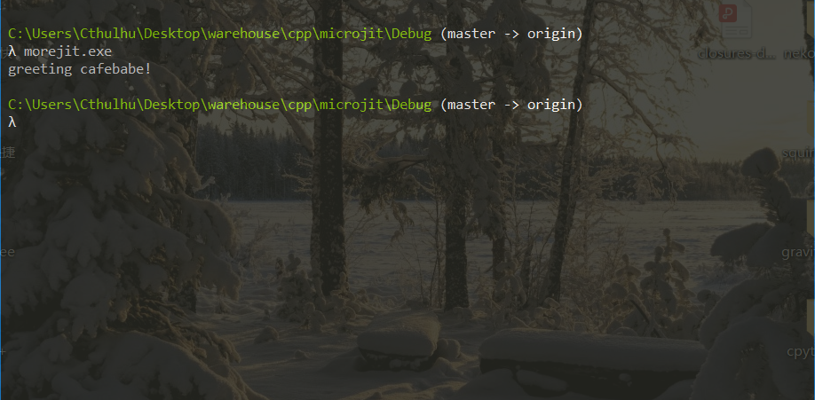
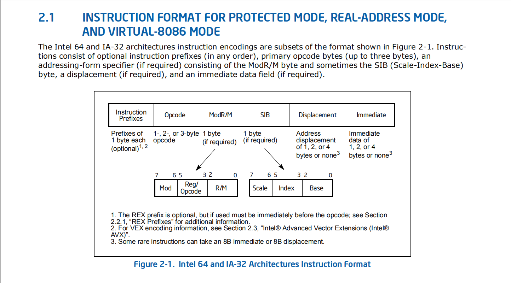

# morejit
morejit can facilitate generating architecture-dependent machine code at runtime. In general, it can be used to build a **JIT** compiler, you can also use it to write some shellcode at runtime to ensure the robustness of your system or do anything which requires dynamic creation behaviors.

# Overview
This demo shows how to use **morejit**, it will generate machine code for Intel x86 architecture and call it immediately:
```cpp
#include "instr_x86.hpp"
#include "morejit_x86.hpp"
#include "type_x86.hpp"

int main() {
    // Allocate 500 bytes to store native code
    x86jitcode c{500};
    c.write_text("greeting %x%x!");

    // Fullfil native code
    __jitcode {
        c.push(ebp);
        c.mov(ebp, esp);
        c.push(addr(ebp, 16));
        c.push(addr(ebp, 12));
        c.push((int)c.get_text_ptr());
        c.call(addr(ebp, 8));
        c.add(esp, 12);
        c.pop(ebp);
        c.ret();
    }
    // Dump generated native code to stdout
    c.dump();

    // Perform function
    auto func =
        c.as_function<void (*)(int (*)(const char* const, ...), int, int)>();
    func(&printf, 0xcafe, 0xbabe);
}
```
Simplely put, this codelet allocates an `executable+writable+readable` memory arean using platform-dependent function(For windows, that's `VirtualAlloc/Free`), and fullfil machine code into it. After that, it forcely covnerts the pointer points to this memory arean as a function `fun`, passes three arguments and calls it. We will get the following output:


# Supported x86 instruction set
All instructions are lower-cases in source code, e.g, `mov(eax,addr(ebx,ecx,4,7))` moves data from memory address `[ebx,ecx*4+7]` to `eax`. For more details about how to use APIs, see its accompanying demonstrations.

| instruction | description |
| :---------: | :---------: |
| ADD | Add |
| AND | Logical AND |
| CALL | Call Procedure (in same segment) |       
| CMP | Compare Two Operands |
| DEC | Decrement by 1 |
| DIV | Unsigned Divide |
| HLT | Hal |    
| IDIV | Signed Divide |
| IMUL | Signed Multiply |
| INC | Increment by 1 |
| JMP | Unconditional Jump (to same segment) |
| MOV | Move Data |
| MUL | Unsigned Multiply |
| NEG | Two's Complement Negation |
| NOP | No Operatio |    
| NOT | One's Complement Negation |
| POP | Pop a Word from the Stack |
| OR | Logical Inclusive OR |
| PUSH | Push Operand onto the Stack |
| RET | Return from Procedure (to same segment) |
| SAR | Shift Arithmetic Right |
| SHL | Shift Left |
| SHR | Shift Right |
| SUB | Integer Subtraction |
| TEST | Logical Compare |
| SUB | Integer Subtraction |

# Details
Intel architecture instructions formats are as follows:

